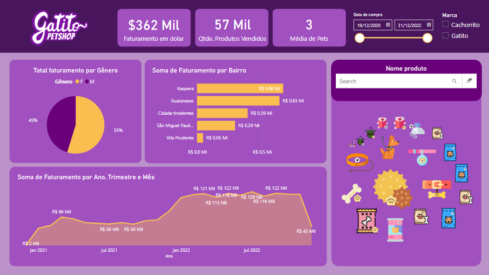

# [Gatito Petshop](https://app.powerbi.com/view?r=eyJrIjoiZWMwY2JiYzYtMjE0ZC00YTFlLWE0ZmUtMDE4MTFkMDc5YWQ5IiwidCI6IjU2MDcwNDI5LWM1ZWQtNDlhMi05MTAzLTJlZjg1NjUzYTg2MSJ9)

## Sobre o dashboard
### A Helô, dona de um petshop fictício, estava planejando montar uma nova loja em outro lugar, então ela pediu um dashboard que reunisse o faturamento atual da loja, possibilidade de filtrar os dados pela marca principal ou filiada, o gênero dos clientes e a média de pets. 